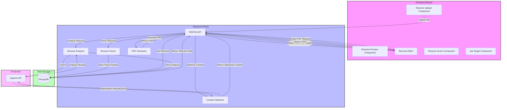
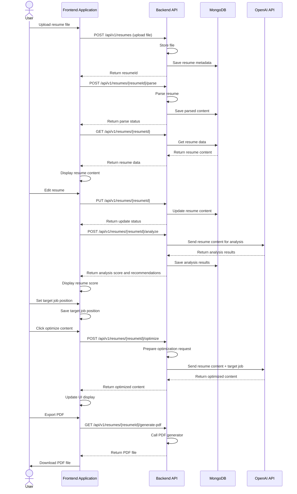
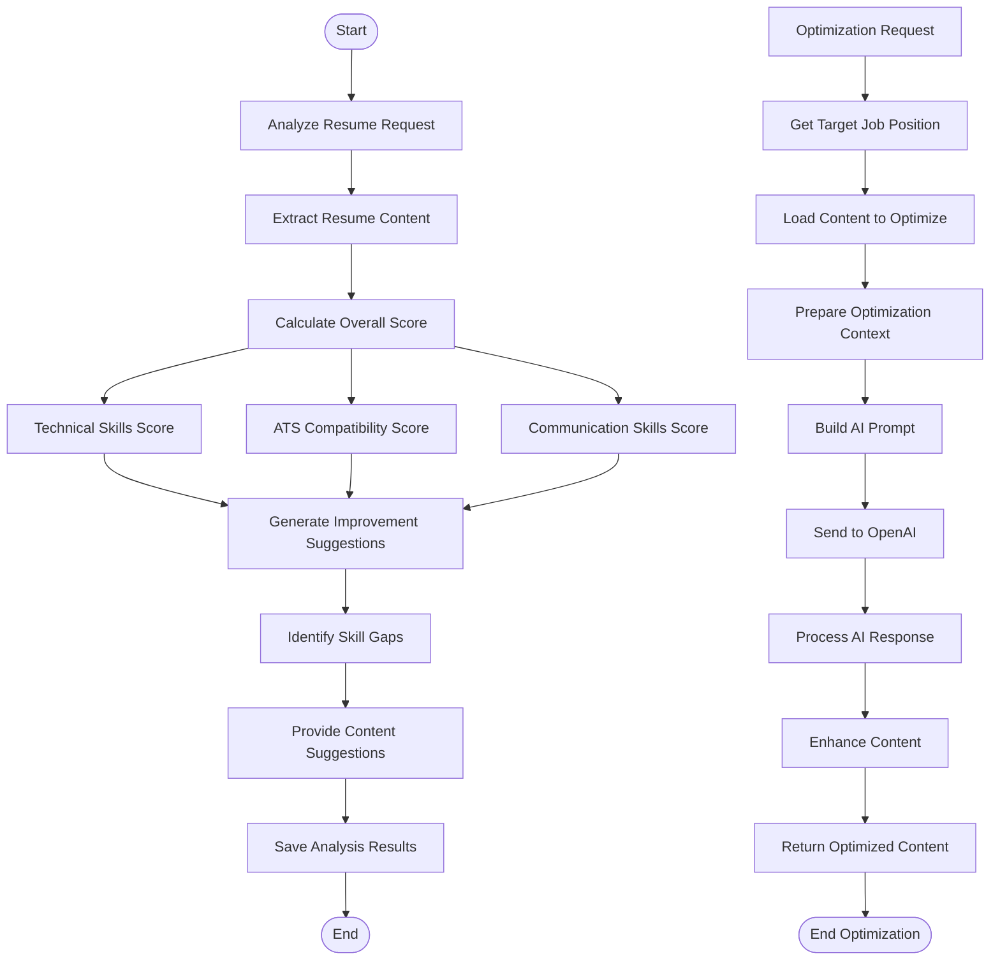
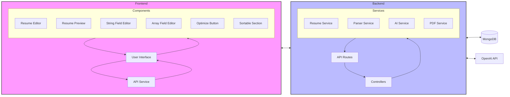
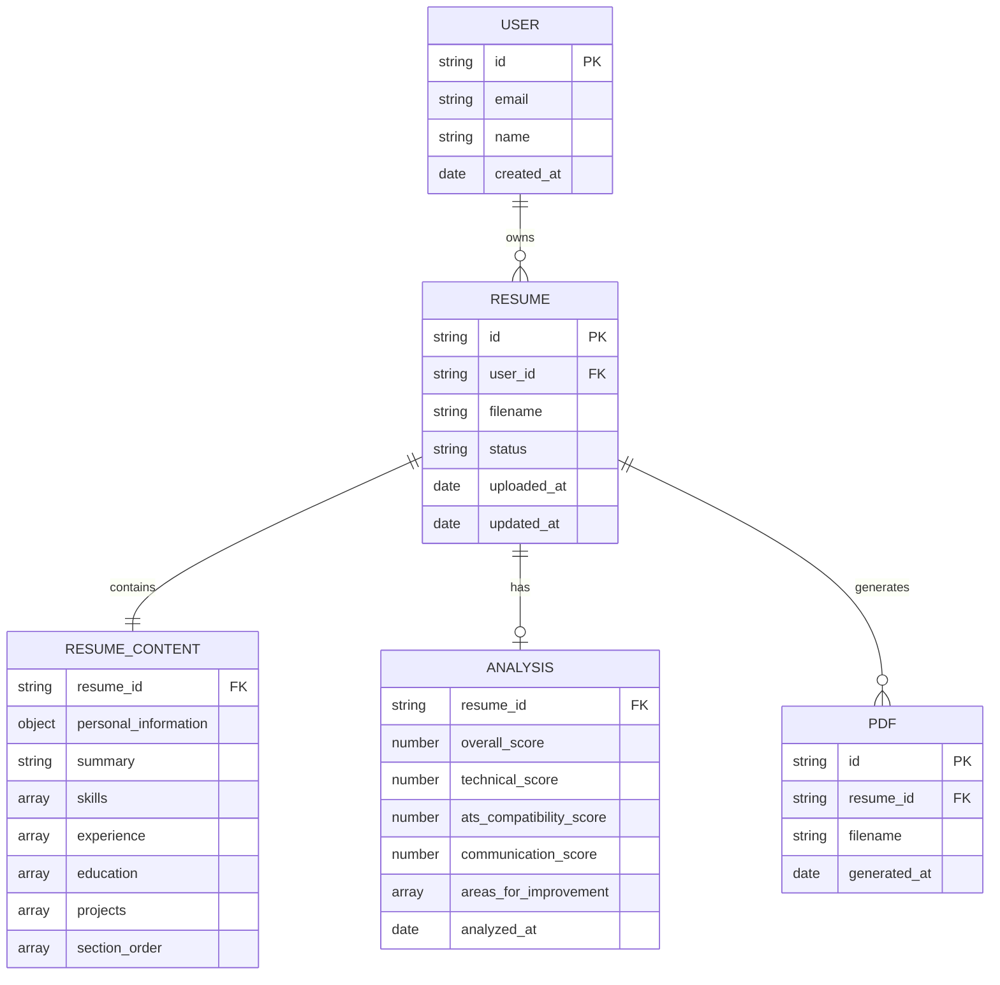
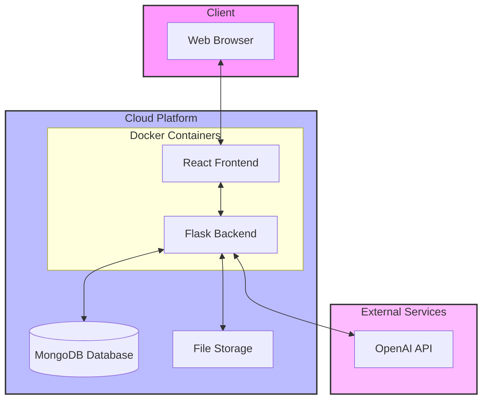

# Resume Optimization System Flow Diagrams

## Overall System Architecture

## User Interaction Flow

## Resume Parsing Flow

## PDF Generation Flow

## Resume Analysis and Optimization Flow

## Frontend-Backend Interaction Diagram

## Data Model Relationship Diagram

## Deployment Architecture Diagram

